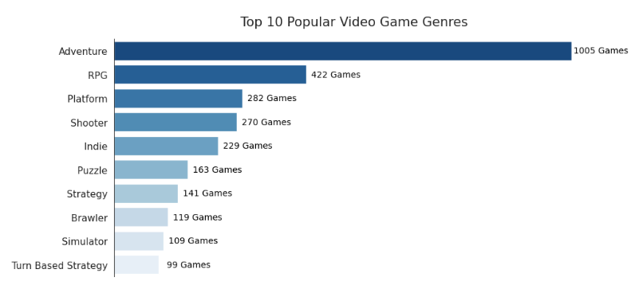
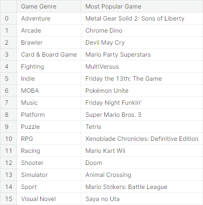
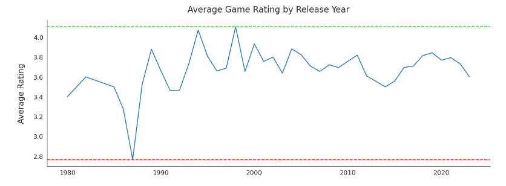
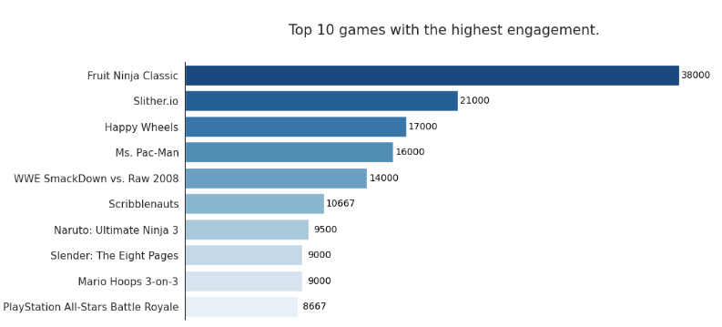
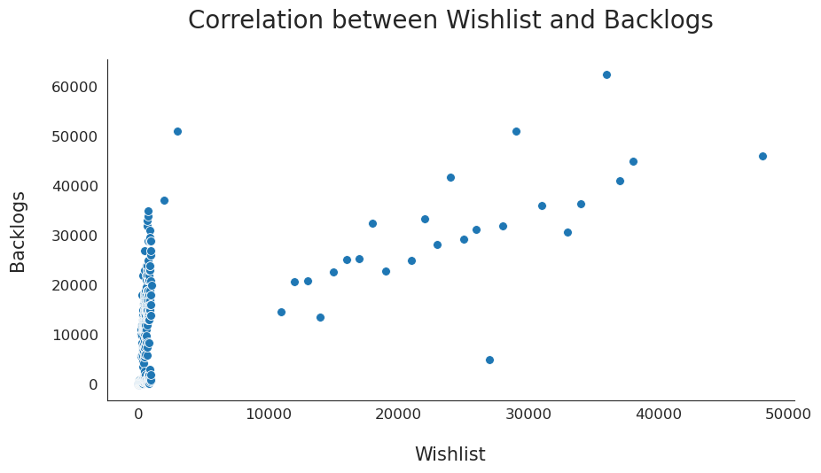
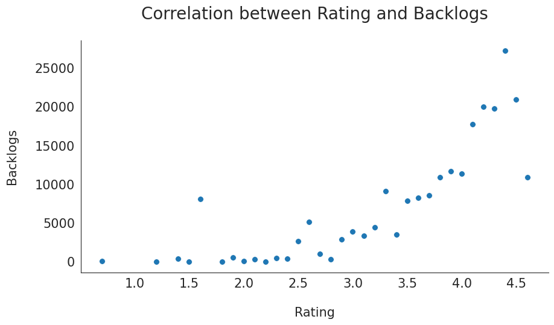

 -OR-

<h1 align="center">Popular Video Games EDA</h1>

    

---
- [Introduction](#introduction)
    - [In this project,](#in-this-project)
- [Data Source](#data-source)
- [Conclusion](#conclusion)
  - [Findings Summary](#findings-summary)
- [Acknowledgement](#acknowledgement)

# Introduction 

Video games have become an increasingly popular form of entertainment in recent years, with the industry experiencing tremendous growth and success. Since the release of the first commercial video game, "Computer Space," in 1971, the industry has continued to evolve and expand, with new technologies and platforms constantly being introduced.

Today, video games are played by people of all ages and backgrounds, and the gaming community has grown to be a vibrant and passionate group of individuals. The rise of online gaming has allowed gamers to connect and play with others from all over the world, creating a global community that is constantly evolving and growing.

### In this project, 

We will be exploring a dataset of popular video games dating from 1980 to 2023, including 
- Release dates. 
- Number of playes.
- Number of active players. 

The dataset also includes information about the platforms on which the games were released, the genres they belong to, and other relevant details.

We will be analyzing this dataset to gain insights into various aspects of the video game industry, including 

- The popularity of different genres. 
- The trend of games rating over time (release date). 
- The level of engagement of players with games. 

Additionally, we will be exploring the phenomenon of "backlogging," which refers to the practice of keeping a list of games that one has yet to play or finish.

By delving into this rich dataset, we hope to uncover interesting trends and patterns in the world of video games, and gain a deeper understanding of the gaming community and industry as a whole. So, join us on this exciting journey as we explore the world of video games through data analysis!

# [Data Source](https://www.kaggle.com/datasets/arnabchaki/popular-video-games-1980-2023)

This dataset contains a list of video games dating from 1980 to 2023, it also provides things such as release dates, user review rating, and critic review rating.

Not only can you find the popular games mentioned here but also the obscure indie ones which we have forgotten in time!

Backlogged is a video game collection website mixed with social elements to focus on bringing your gaming profile to life. Create a free account to get started on logging the games you've played, and then rating and reviewing as you go! Go into detail with logging platforms, time played, and even a daily journal to keep track your daily gaming progress with playthroughs. It's all tailored to how much you want to log, so that your profile fits you. Then outside of that you can create lists of games, friend other users, follow their activities, and so much more!

# Conclusion

My analysis of popular video games from 1980 to 2023 revealed several key insights. We found that the most popular video game genres are **Adventure**, followed by RPG, Platform, and Shooter. Within these genres, some of the most popular games include **Metal Gear Solid 2: Sons of Liberty** (Adventure), Chrome Dino (Arcade), Devil May Cry (Brawler), and Mario Party Superstars (Card & Board Game).

I also observed that the average rating of video games experienced **significant fluctuations from 1980 through the 1990s**, with a notable decline in the late 1980s. However,** starting in the 2000s, the average rating has become more stable and consistent**.

In terms of player engagement, I found that **Fruit Ninja Classic** had the highest level of engagement, followed by Slither.io, Happy Wheels, and Ms. Pac-Man.

Our analysis also revealed a strong correlation between the 'Wishlist' and 'Backlogs' variables. **This suggests that people who have added a game to their wishlist are likely to have access to it but may not have started playing it yet**. Furthermore, we found that **games with high ratings and high wishlist counts tend to have the most backlogged players**.

---

## Findings Summary
---

1. **The most popular video game genres are Adventure, followed by RPG, Platform, and Shooter.**

    

    
Click to View Visualization.

    
    

****

2. **Some of the most popular games within these genres include Metal Gear Solid 2: Sons of Liberty (Adventure), Chrome Dino (Arcade), Devil May Cry (Brawler), and Mario Party Superstars (Card & Board Game).**

    

    
Click to View Visualization.

    
    

****

3. **The average rating of video games experienced significant fluctuations from 1980 through the 1990s but has become more stable and consistent since the 2000s.**

    

    
Click to View Visualization.

    
    

****

4. **Fruit Ninja Classic had the highest level of player engagement, followed by Slither.io, Happy Wheels, and Ms. Pac-Man.**

    

    
Click to View Visualization.

    
    

****

5. **There is a strong correlation between the 'Wishlist' and 'Backlogs' variables.**

    

    
Click to View Visualization.

    
    

****

6. **Games with high ratings and high wishlist counts tend to have the most backlogged players.**

    

    
Click to View Visualization.

    
    

****

# Acknowledgement 

- [Find the max value of a column and return the corresponding row values - Stackoverflow.](https://stackoverflow.com/questions/15741759/find-maximum-value-of-a-column-and-return-the-corresponding-row-values-using-pan#:~:text=Assuming%20df%20has%20a%20unique%20index%2C%20this%20gives,so%20df.loc%20may%20return%20more%20than%20one%20row.)

- [pandas.DataFrame.idxmax - Pandas Documentation.](https://pandas.pydata.org/pandas-docs/stable/reference/api/pandas.DataFrame.idxmax.html)

- [Barplot data labels inspiration - (Stackoverflow).](https://stackoverflow.com/questions/59213470/how-to-annotate-text-on-horizontal-seaborn-barplot)

- [Banner Design - Canva.](https://canva.com/)

